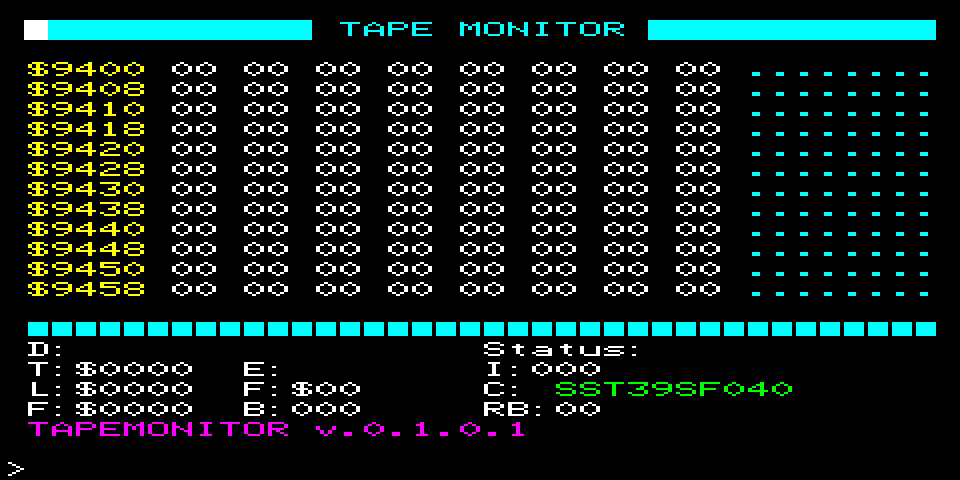

# P2000T Tape Monitor

## Purpose
Read data from tapes and write them to an external ROM chip.

## Assembly
Assemble the source code in [src/main.asm](src/tapemon.asm) using the
P2000T-ide or the [tniasm Z80 assembler](http://www.tni.nl/products/tniasm.html) 
and place the resulting binary file in a SLOT1 cartridge.

## Commands
Upon boot of the P2000T a monitor-type of programmed is displayed from which
the user can read out the address space of the P2000T and interface with the
tape recorder. The program accepts the following commands:

### Single-byte commands

* `i`/`I`: Read all programs that are on the tape (index)
* `w` / `W`: Rewind the tape
* `rxxxx` / `Rxxxx`: Read memory at address $xxxx.
* `l` / `L`: Load a single block from the tape.
* `n`: Forward $60 bytes in monitor
* `p`: Reverse $60 bytes in monitor
* `P`: Print the archive

### Full commands

* `copy`: Copy the tape to the SST39SF040 chip
* `format`: Format the SST39SF0x0 chip

## File system

Data is stored on the ROM using a custom file system. Specifications of the file
system are documented [in a separate file](docs/fat.md).