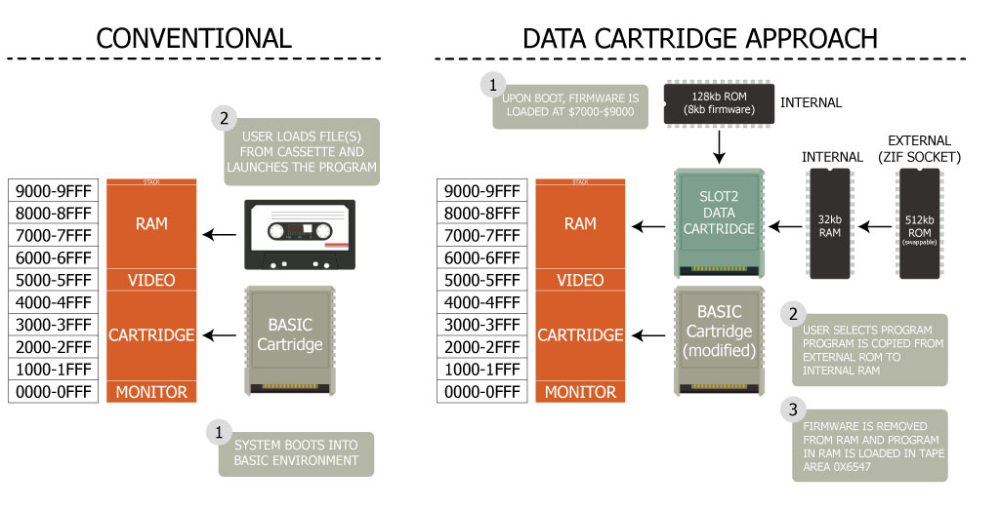

# P2000T Tape Monitor

## Features

This project is still under development. Below a list of features can be found.
Checked features are implemented, unchecked features are work in progress.

- [x] Launch tape files from data cartridge in SLOT2
- [x] Write tape data to data cartridge in SLOT2
- [ ] Write data back to tapes from the data cartridge

## Explainer

In the image below, the working of the data cartridge is schematically shown.
In the conventional approach, the user would start the P2000T and load programs
from the cassette. Under the hood, data is copied from the cassette to the
internal memory after which the program can be started.

The data cartridge essentially imitates this process. Upon boot, a driver is 
loaded from the data cartridge into memory and launched. This driver
scans the external ROM chip for programs and shows a list of those programs. The
user can then select a program and executes it. Upon selection, the program is
first copied from the external chip to the internal RAM chip in the data cartridge.
Next, the driver is unloaded from memory, and the new data is copied from the 
RAM chip to the same position as where normally cassette data is copied. 
Finally, the `RUN` command is executed which starts the program.

## Contents
This repository is organized as follows

* `basicmod`: Modified BASIC ROM. This ROM is needed for the cartridge in SLOT1.
* `cassette-utility`: Source code of the SLOT1 program to copy programs and data
  from the data cassette to the data cartridge.
* `docs`: Technical documentation; mainly needed for development.
* `flasher`: SLOT1 program to transfer the launcher from external ROM chip
  on the data cartridge to the internal ROM.
* `gui`: GUI to add and delete programs from the data cartridge and to format a
  chip.
* `launcher`: Source code of the launcher application.
* `pcb`: PCBs for the SLOT2 data cartridge. Also includes .stl files for the cartridge enclosure.

## Files

The latest version of the files below can be obtained from the action artifacts
of the [last build](https://github.com/ifilot/p2000t-tape-monitor/actions/workflows/build.yml).

* [`BASICBOOTSTRAP.BIN`](https://github.com/ifilot/p2000t-tape-monitor/releases/latest/download/BASICBOOTSTRAP.BIN.zip): 
  Modified BASIC cartridge. This is a SLOT1 cartridge.
* [`CASSETTE-UTILITY.BIN`](https://github.com/ifilot/p2000t-tape-monitor/releases/latest/download/CASSETTE-UTILITY.BIN.zip): 
  Utility for copying files directly from the cassette to the (external) ROM chip. This is a SLOT1 cartridge.
* [`FLASHER.BIN`](https://github.com/ifilot/p2000t-tape-monitor/releases/latest/download/FLASHER.BIN): 
  Flasher for the data cartridge driver. This is a SLOT1 cartridge that copies 
  the driver from the external to the internal ROM on the SLOT2 cartridge.
* [`LAUNCHER.BIN`](https://github.com/ifilot/p2000t-tape-monitor/releases/latest/download/LAUNCHER.BIN): 
  Driver for the data cartridge. This driver is stored on the internal ROM of 
  the SLOT2 cartridge.
* [`p2000t-fat-flasher--installer-win64.exe`](https://github.com/ifilot/p2000t-tape-monitor/releases/latest/download/p2000t-fat-flasher-installer-win64.exe.zip): 
  Windows installer for the Flasher GUI. This GUI is used to put cassette files 
  on a ROM chip which can be loaded on the P2000T.

## File system

Data is stored on the ROM using a custom file system. Specifications of the file
system are documented [in a separate file](docs/fat.md).

## FAQ

* Where can I find programs?

  *A rather huge archive of P2000T cassette programs 
  (which is also being actively maintained), can be found in the
  [P2000T Preservation Project](https://github.com/p2000t/software) repository.*
* Where can I find the documentation?

  *All documentation can be found on the [philips-p2000t.nl](https://philips-p2000t.nl) website.*