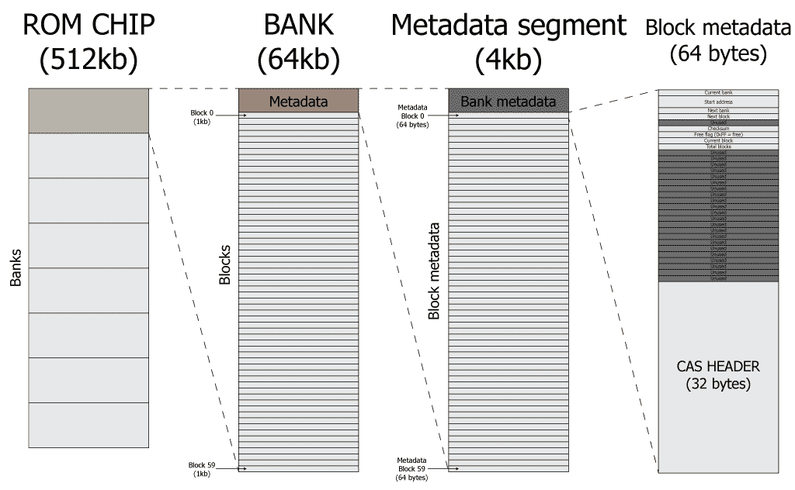

# File Allocation Table on ROM chips

This page explains how data is stored on the ROM chips. The Tape monitor uses
the SST39SF0x0 type of ROM chips which contain 128kb, 256kb or 512kb of data
for the 040, 020 and 010 models, respectively.

## Summary

* Each ROM has 2, 4, or 8 banks for a total of 128kb, 256kb, or 512kb of data.
* A bank corresponds to 64kb hosting 60 blocks of 1kb of data each.
* A file is a (not necessarily continuous) set of blocks, corresponding to
  an entry on a tape.
* Each bank has a metadata section of 4kb that holds the metadata of the block
  and of the files.

A schematic overview is given in the figure below.

## Storage model

The first 4kb of each bank are used to store the metadata of that bank. Herein,
the first 256 bytes of the metadata section contain the start blocks for the
files. The next 60 entries correspond to 64 bytes of metadata information for
each block. An schematic overview is provided in the table below.

|   Address   | Description       |
|-------------|-------------------|
| $0000-$00FF | Bank metadata     |
| $0100-$013F | Metadata block 0  |
| $0140-$017F | Metadata block 1  |
| $0180-$01BF | Metadata block 2  |
| $01C0-$01FF | Metadata block 3  |
| $0200-$023F | Metadata block 4  |
| .....-..... | Metadata block i  |
| $0FC0-$0FFF | Metadata block 59 |

Note that because a bank can only contain at most 60 blocks of data, the bank
metadata section will at most use 60 of the in total 256 entries.

### Block metadata

The block metadata segments, each 64kb in size, are divided into a lower and
upper segment. The upper segment is a copy of the cassette metadata as stored
at $6030 in memory when reading from a tape. The upper segment holds a
per block checksum and a reference to the next bank and block if the file
uses more than one block. If not, the default value corresponds to `0xFF`.

|   Address   | Description        |         Notes            |
|-------------|--------------------|--------------------------|
|       $0000 | Current bank  (F)  |                          |
| $0001-$0002 | Start address (F)  |                          |
|       $0003 | Next bank          | $FF when last block      |
| $0004       | Next block         | $FF when last block      |
| $0005       | *Unused*           |                          |
| $0006-$0007 | Checksum           | CRC-16, see below        |
|       $0008 | Free?              | $FF if free, else $00    |
|       $0009 | Current block      |                          |
|       $000A | Total blocks       |                          |
| $0009-$001F | *Unused*           |                          |
| $0020-$003F | CAS header         |                          |

### Storage location of cassette metadata

The CAS header basically corresponds to memory locations $6030-$604F of the
P2000T after reading a block from the cassette. These addresses are hardcoded 
in the P2000T ROM (e.g. 0x0000 - 0x1000) and cannot be changed.

|   Address   | RAM Address | Description      |
|-------------|-------------|------------------|
| $0020-$0021 | $6030-$6031 | Transfer address |
| $0022-$0023 | $6032-$6033 | File length      |
| $0024-$0025 | $6034-$6035 | Record length    |
| $0026-$002D | $6036-$603D | Descriptor (1/2) |
| $002E-$0030 | $603E-$6040 | Extension        |
| $0031-$0032 | $6041-$6042 | Type             |
| $0033-$0034 | $6043-$6044 | Start boot       |
| $0035-$0036 | $6045-$6046 | Load             |
| $0037-$003E | $6047-$604E | Descriptor (2/2) |
|       $003F |       $604F | Blocks remaining |

### Checksum

For each 1kb block of data, a 16-bit checksum is generated using the 
CRC-16/XMODEM checksum algorithm. Efficient Z80 source code for the algorithm 
is taken from [here](https://mdfs.net/Info/Comp/Comms/CRC16.htm).
A handy site for generating checksums can be found [here](https://crccalc.com/).

## Formatting

When a ROM is formatted, first all banks are wiped (i.e. set to `0xFF`). Next,
the metadata for each bank is set. This corresponds to 3 bytes per block metadata
section. All other bytes remain at (`0xFF`).